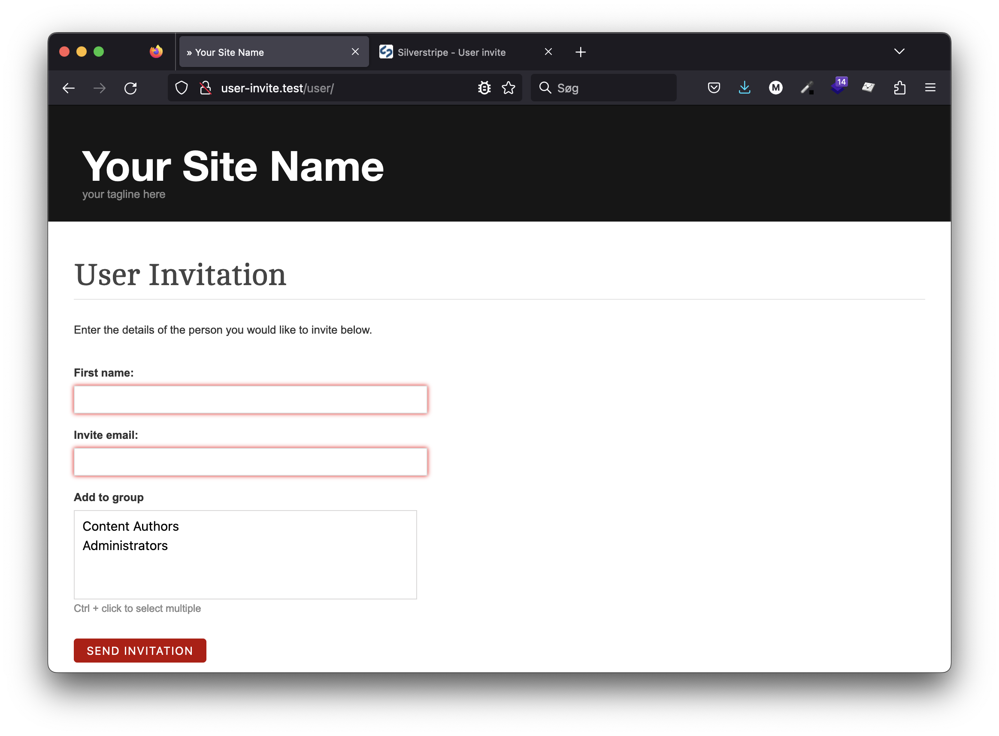
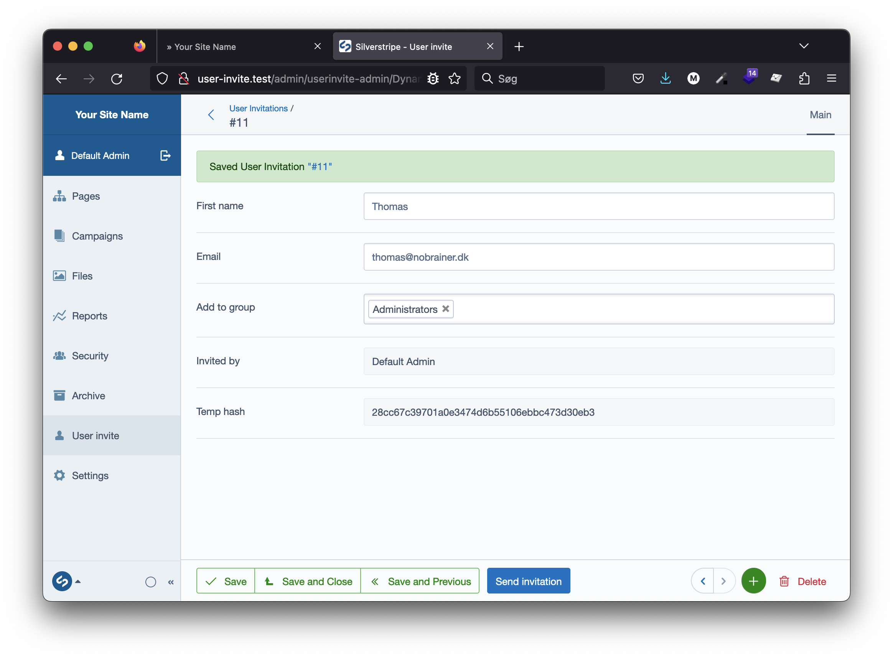

# SilverStripe User Invitation

This module adds the ability to invite users to a secure website (e.g. Intranet or Extranet).

[](https://github.com/dynamic/silverstripe-user-invitation/actions/workflows/ci.yml)
[](https://codecov.io/gh/dynamic/silverstripe-user-invitation)

[](https://packagist.org/packages/dynamic/silverstripe-user-invitation)
[](https://packagist.org/packages/dynamic/silverstripe-user-invitation)
[](https://packagist.org/packages/dynamic/silverstripe-user-invitation)
[](https://packagist.org/packages/dynamic/silverstripe-user-invitation)

## Requirements

 * silverstripe/framework ^4

 ## Installation

```
composer require dynamic/silverstripe-user-invitation
```

## License

See [License](LICENSE.md)

## Invite users to Silverstripe CMS
This module makes it posible to invite users that you would like to register on your site. Users can be invited from either a:
- frontend form
  

- or via an admin interface in the CMS.
  
## Features

* Quick-entry invitation form (By default only first name and email fields are required to invite someone)
* Sends email invitations to recipient
* Supports optional user group assignment (See below for how to enforce this group selection) 
* Invitation expiry can be set via configuration.
* Default SilverStripe member validation is applied.
* Create and send invites from CMS admin interface

### Force required user group assignment
Place the following in your mysite/_config/config.yml
```yml
Dynamic\SilverStripe\UserInvitations\Model\UserInvitation:
    force_require_group: true
```

### Template override
To update the base template use `updateMainTemplates`. It defaults to `Page`.

```php
/**
 * @param array $mainTemplates
 */
public function updateMainTemplates(&$mainTemplates)
{
    array_unshift($mainTemplates, 'InvitationPage');
}
```

### Redirect after successful user creation

You can set a custom 'BackURL', that the user will be redirected  to, after having completed signup from invitation.
```yml
Dynamic\SilverStripe\UserInvitations\Control\UserController:
    back_url: '/admin/'
```

## Please remember to set an admin_email (used as sender)
This is done in your app/_config/email.yml file
```yml
SilverStripe\Control\Email\Email:
    admin_email: #Default email this site sends emails from
        mail@example.com: 'Admin at example.com'
```
For easy email testing, use: https://mailcatcher.me/

## Maintainers

 *  [Dynamic](https://www.dynamicagency.com) (<dev@dynamicagency.com>)

## Credits
Forked from [FSWebWorks/silverstripe-user-invitation](https://github.com/FSWebWorks/silverstripe-user-invitation) to upgrade for Silverstripe 4 & 5.

## Bugtracker
Bugs are tracked in the issues section of this repository. Before submitting an issue please read over
existing issues to ensure yours is unique.

If the issue does look like a new bug:

 - Create a new issue
 - Describe the steps required to reproduce your issue, and the expected outcome. Unit tests, screenshots
 and screencasts can help here.
 - Describe your environment as detailed as possible: SilverStripe version, Browser, PHP version,
 Operating System, any installed SilverStripe modules.

Please report security issues to the module maintainers directly. Please don't file security issues in the bugtracker.

## Development and contribution
If you would like to make contributions to the module please ensure you raise a pull request and discuss with the module maintainers.
